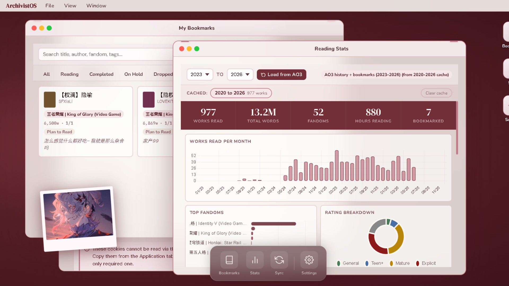
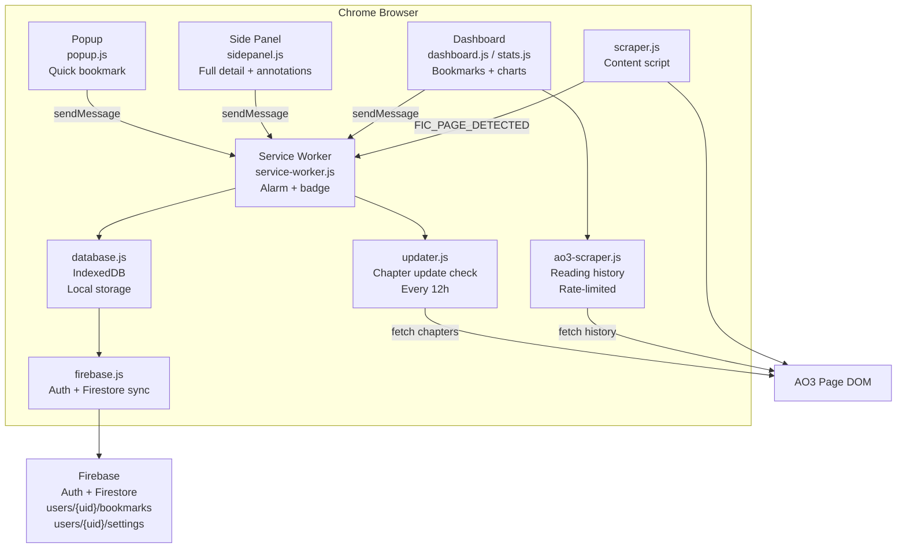

# archivist

A Chrome extension built to bookmark, annotate, and track fanfiction on AO3 (Archive of Our Own). Built as a personal learning project to explore Chrome extension development, browser APIs, and web tooling, with plans to extend into machine learning features for personalised reading recommendations.

[](https://github.com/mlemxy/archivist) [](https://developer.chrome.com/docs/extensions/mv3/) [](LICENSE) [](https://firebase.google.com/)

> **Note:** Sync and authentication are currently in beta and may be unstable. Known issues are tracked below. Local bookmarking works fully without an account.



---

## Tech Stack

    

---

## Architecture



**Data flow:**
1. User visits an AO3 fic page -- `scraper.js` extracts metadata and sends it to the service worker
2. User opens the popup or side panel -- retrieves the cached fic from `chrome.storage.session`
3. Save writes to IndexedDB locally first, then syncs to Firestore if signed in
4. The service worker alarm fires every 12 hours and delegates chapter checks to `updater.js`
5. The dashboard pulls reading history from AO3 via `ao3-scraper.js` and renders charts with Chart.js

---

## Features

### Bookmarking
- One-click bookmark any AO3 fic from the browser toolbar
- Quick save with reading status, short note, and personal tags from the popup
- Full side panel with complete AO3 metadata: fandoms, relationships, characters, additional tags, summary, word count, and chapter progress
- Personal annotations with no character limit, star ratings (1-5), and custom tags
- Reading status: Reading, Completed, On Hold, Dropped, Plan to Read (and custom statuses)
- Track your last read chapter with a progress indicator

### Dashboard
- macOS-style desktop interface with draggable, resizable windows and a bottom dock
- Menubar with File, View, and Window menus
- Searchable, filterable bookmark library with sort options (newest, oldest, word count, rating, recently updated on AO3)
- Status tab filters, pagination (12 per page), and a fic detail modal
- Delete bookmarks from the grid or from the detail modal
- Upload a custom wallpaper and pin a polaroid-style photo anywhere on the desktop

### Chapter Update Tracker
- Toggle per-fic notifications from the side panel
- Every 12 hours, automatically checks AO3 for new chapters on ongoing fics -- fics with unknown total chapters (`?`) or where current chapters have not reached the total
- Skips fics you have marked Dropped or Completed
- Updates chapter count and AO3 status locally when new chapters are found
- Pulsing "New chapter!" badge appears on fic cards and in the side panel
- Badge clears when you click into the fic
- Chrome badge count on the extension icon and system notification

### Reading Stats
- Pulls your full AO3 reading history using your session cookies (stored locally only, never synced)
- Smart caching: if you have loaded 2020-2026, requesting any year in that range loads from cache instantly without re-scraping
- 9 interactive Chart.js charts: works read per month, top fandoms, rating breakdown, top ships, AO3 completion status, top characters, reading status breakdown, star ratings, and top personal tags
- KPI row: total works, total words, unique fandoms, estimated reading hours, bookmarked count
- Respectful rate limiting: 4s between pages, 5-minute pause every 10 pages, exponential backoff on 429 responses

### Sync (beta)
- Sign in with email/password to sync your bookmarks across devices in real time via Firebase Firestore
- On first sign-in, local bookmarks are uploaded to Firestore
- Subsequent sign-ins only push changes since the last sync
- Real-time listener picks up changes made on other devices
- AO3 cookies, wallpaper, and pinned photo are never synced -- local only

---

## Installation

```bash
git clone https://github.com/mlemxy/archivist.git
cd archivist
npm install
```

1. Open Chrome and go to `chrome://extensions`
2. Enable **Developer mode** (top right toggle)
3. Click **Load unpacked** and select the `archivist` folder
4. Add your icons to `assets/icons/` -- `icon16.png`, `icon48.png`, `icon128.png`

---

## Using Your Own Firebase Project

The repo ships with a default Firebase config. To use your own:

1. Create a project at [console.firebase.google.com](https://console.firebase.google.com)
2. Enable **Authentication** then Email/Password
3. Create a **Firestore Database** in production mode
4. Set Firestore security rules:

```
rules_version = '2';
service cloud.firestore {
  match /databases/{database}/documents {
    match /users/{userId}/{document=**} {
      allow read, write: if request.auth != null && request.auth.uid == userId;
    }
  }
}
```

5. Replace the config object in `src/dashboard/firebase.js` with your project config (found in Project Settings then Your apps)

---

## Getting Your AO3 Cookies (for Stats)

AO3 does not have a public API. The stats feature scrapes your reading history using your session cookies. These are stored locally in IndexedDB and never leave your device.

1. Open [archiveofourown.org](https://archiveofourown.org) while logged in
2. Right-click then **Inspect** then **Application** tab
3. Sidebar then **Cookies** then `https://archiveofourown.org`
4. Copy `_otwarchive_session` (required) and optionally the Cloudflare cookies
5. Paste into **Settings then AO3 Connection** in the dashboard

---

## Project Structure

```
archivist/
├── manifest.json
├── src/
│   ├── popup/              Quick bookmark popup
│   ├── sidepanel/          Full detail side panel
│   ├── dashboard/          macOS-style dashboard
│   │   ├── dashboard.html/css/js
│   │   ├── stats.js        Reading stats and charts
│   │   ├── wrapped.js      Year-in-review cards
│   │   ├── updater.js      Chapter update checker
│   │   ├── ao3-scraper.js  AO3 history scraper
│   │   ├── firebase.js     Firebase auth and Firestore
│   │   └── auth.js         Sync window UI
│   ├── background/         Service worker and alarm scheduler
│   ├── content/            AO3 page scraper (content script)
│   └── db/                 IndexedDB layer
└── assets/
    ├── icons/              Add your PNG icons here
    └── lib/                Bundled libraries: Chart.js, Firebase SDK, html2canvas
```

---

## Known Issues

- **Sync and authentication are in beta.** First-time sync can be slow for large libraries. Firebase listeners occasionally require a page refresh to reconnect after a long idle period.
- **Google sign-in** requires additional per-developer setup (Chrome OAuth client ID) and is not configured by default. Use email/password instead.
- **AO3 rate limiting** -- the stats scraper may be blocked temporarily if AO3's Cloudflare protection triggers. The scraper backs off automatically, but very large histories (100+ pages) can take a long time.
- **Mobile not supported** -- Chrome extensions do not run on iOS or Android. A companion web app for mobile access is planned.

---

## Roadmap

- [x] Popup bookmarking with quick note and tags
- [x] Side panel with full AO3 metadata and annotations
- [x] macOS-style dashboard with draggable windows
- [x] Reading stats with Chart.js
- [x] Chapter update notifications
- [x] Cross-device sync via Firebase
- [ ] Companion web app for mobile access
- [ ] ML-powered reading recommendations

---

## Contributing

Open personal project -- forks and contributions welcome. A few conventions:

- No CDN scripts. All libraries must be bundled locally in `assets/lib/` (Chrome CSP blocks external scripts)
- Keep error messages user-friendly with no technical jargon in the UI
- No em dashes in UI text
- Do not stack CSS patches -- rewrite the affected rule cleanly

---

## License

MIT
